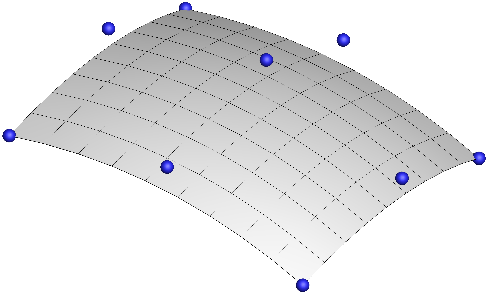
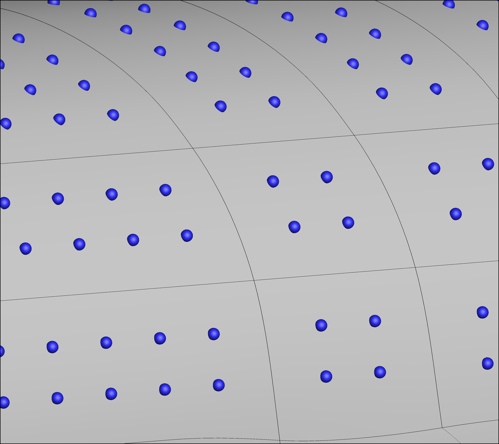
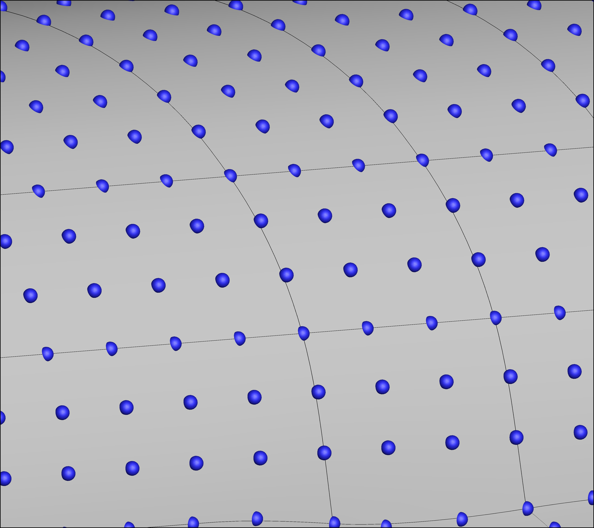
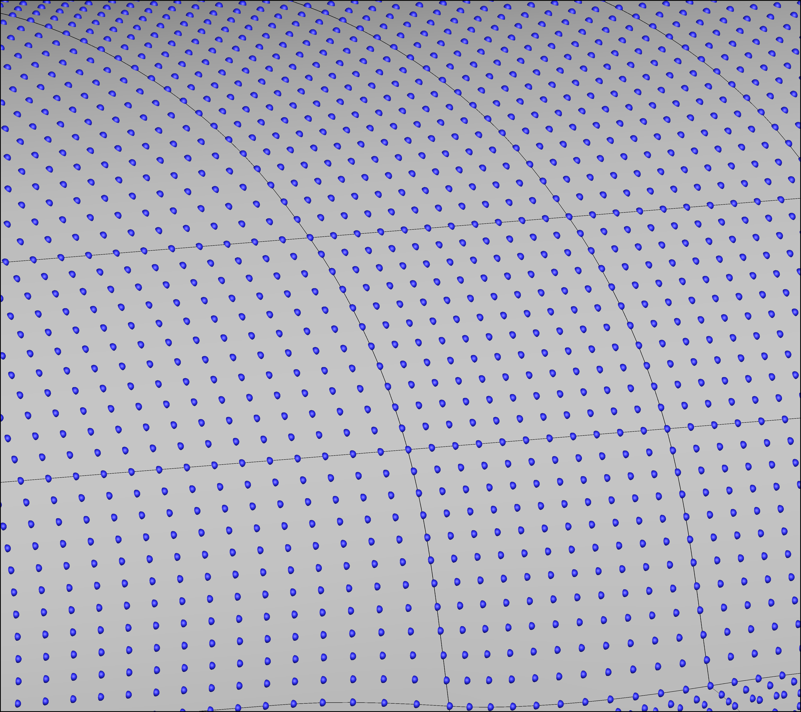

BSE Package
===========

Overview
--------

The B-spline surface-modeling engine (BSE) models surface geometries as a
watertight union of tensor-product B-spline surfaces.
Internally, it keeps track of surfaces, edges, vertices, and groups (groups
are sets of parallel edges).
Its core function is to compute a set of Jacobians that map the global vector
of control points to the global vector of discretized points.

The B-spline surface
--------------------

A B-spline is a piecewise polynomial with minimal support for a given order
and desired smoothness. This means that each control point has an influence
on a small part of the B-spline.
A tensor-product B-spline surface is of the form

.. math::
   \vec P(u, v) = \sum_i \sum_j B_i(u) B_j(v) \vec C_{i,j}

where :math:`u,v` are the parametric coordinates along the curve, :math:`\vec P(u,v)`
are the physical coordinates of a point (with x,y,z components), :math:`\vec C_{i,j}`
is the :math:`(i,j)^\text{th}` control point (with x,y,z components), and 
:math:`B_i(u),B_j(v)` are the :math:`(i,j)^\text{th}` basis functions evaluated at 
:math:`u,v`. The control points define the curve, and the parametric coordinates 
define where a point is along the curve.

Continuity between surfaces
---------------------------

BSE models a watertight geometry with optional :math:`C^1` continuity at the
boundaries between surfaces. This is implemented by defining the control points
of :math:`C^1` edges and vertices to be the average of its adjacent control points.
Edge control points can be averaged from the two adjacent surfaces and
vertex control points can be averaged from the corners of the adjacent surfaces
or from two adjacent edges.

In the BSE code, the following naming convention is used:

- 'df': control points that are free to vary
- 'cp': all control points with the averaging done
- 'pt': discretized points

The global vectors of control points or discretized points are tracked in a
structured ordering and an unstructured ordering:

1. The structured ordering flattens the 2-D arrays from each surface and 
   concatenates them into a single global vector. This ordering double-counts
   control points from shared edges and vertices but is easier to work with.
2. The unstructured ordering orders vertex control points first, then the
   edge control points minus the ends, then the interior surface control points.
   This results in a unique ordering that ensures a watertight geometry
   since :math:`C^0` continuity is inherently enforced at surface boundaries.

Usage
-----

1. *Initialize*: initial list of surfaces to determine the topology
   (how surfaces are connected)
2. *Set B-spline options*: set the B-spline order, number of control points,
   and the number of points for each group
3. *Set differentiability conditions*: specify which edges and vertices
   are to be :math:`C^1`
4. *Assemble*: compute Jacobians
5. *Set control points*: set the 'df' control point values
6. *Apply Jacobians*: compute the points
7. *Project points*: a new discretization or any other list of points can
   be projected onto the B-spline model to find the list of nearest points
   and their parametric coordinates
8. *Compute Jacobian*: a Jacobian for the projected points can be computed
   so they are a linear function of the control points

:mod:`BSE` Package
------------------

.. automodule:: GeoMACH.BSE
    :members:
    :undoc-members:
    :show-inheritance:

:mod:`BSEmodel` Module
----------------------

.. automodule:: GeoMACH.BSE.BSEmodel
    :members:
    :undoc-members:
    :show-inheritance:

:mod:`BSEvec` Module
--------------------

.. automodule:: GeoMACH.BSE.BSEvec
    :members:
    :undoc-members:
    :show-inheritance:

:mod:`test` Module
------------------

.. automodule:: GeoMACH.BSE.test
    :members:
    :undoc-members:
    :show-inheritance:

