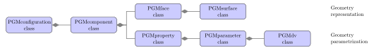
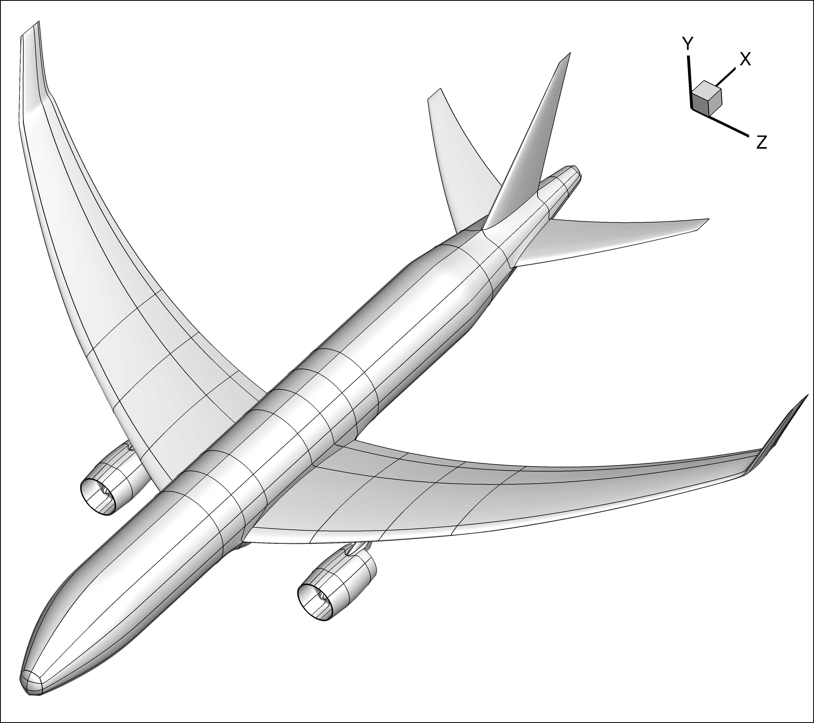
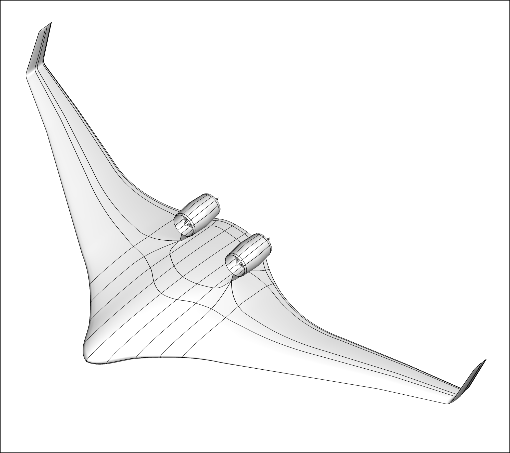
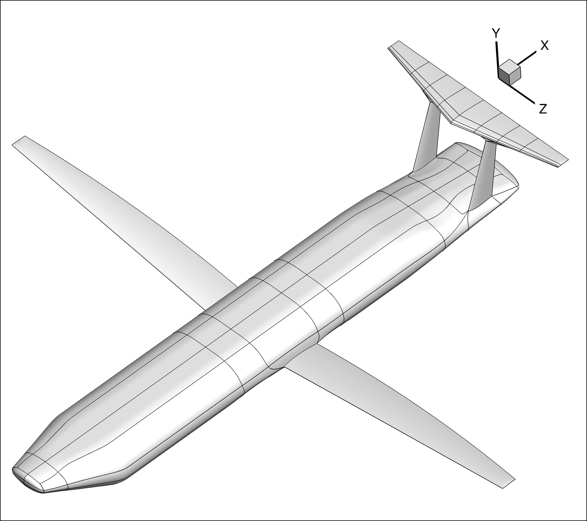
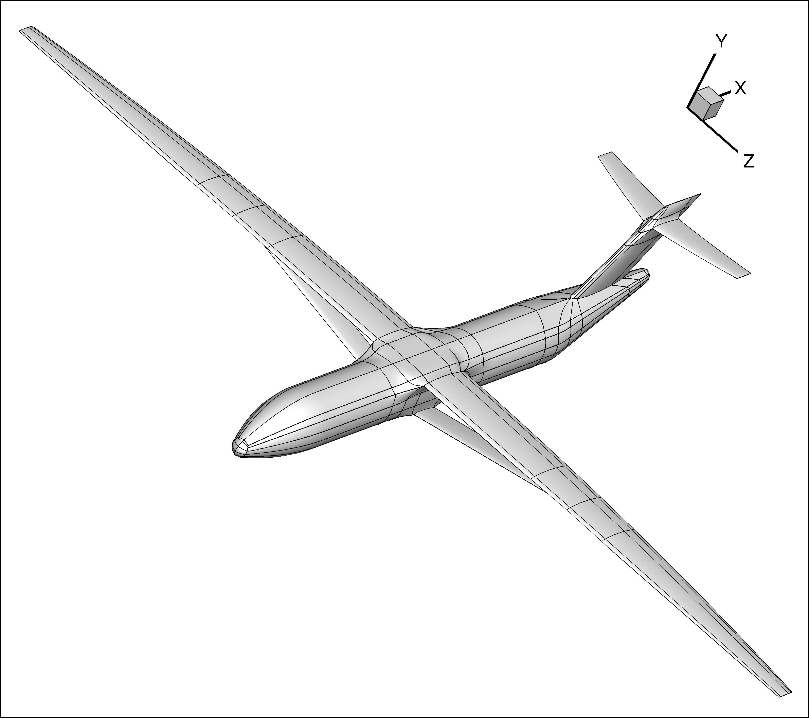
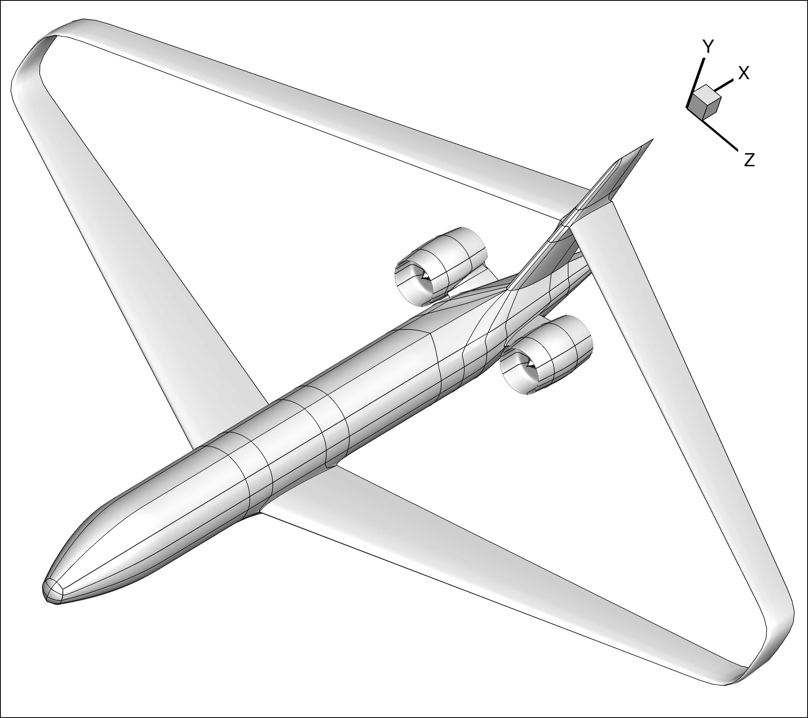
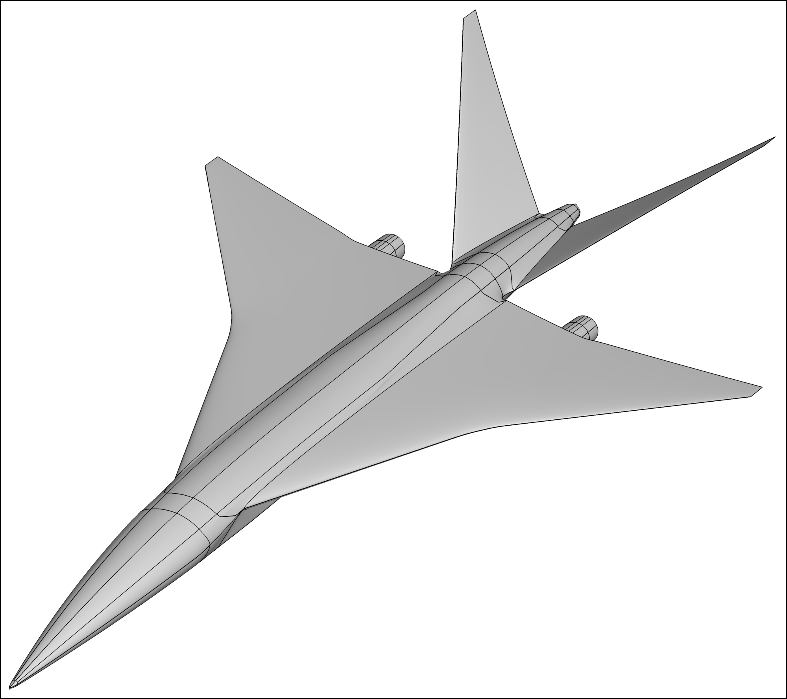

PGM Package
===========

Overview
--------

The parametric geometry modeler (PGM) maps the shape variables specified by the user or
optimizer to the control points that are given to the BSE instance.

Geometry representation
-----------------------

PGM captures a conceptual design-level space of geometries in a differentiable manner by
dividing it into a countable number of configurations that are highly malleable.
Each configuration has a fixed topology, or in other words, the number of surfaces and the 
manner in which they are connected to each other never change for a given configuration.

|

Each configuration is divided into a set of primitive and interpolant components.
The primitive components are the basic building blocks of the aircraft: wing components for 
lifting surfaces, body components for blunt objects like fuselages, and shell components for 
hollow bodies like flow-through nacelles.
The interpolant components interpolate parts of primitive components: junction components that
form the intersection region between a wing component and another primitive component, tip
components that close the ends of wing components, and cone components that are used for the 
nose cone or tail cone of body components.
Each type of component has a fixed number of faces, which in turn contain one or more surfaces
in a structured 2-D array.
The components and their faces are listed in the table that follows.

+-------------+----------+--------------------------------+--------+--------------+------+------+
| Component                                               |        | Face         | *u*  | *v*  |
|                                                         |        |              | dir. | dir. |
+=============+==========+================================+========+==============+======+======+
| Primitive   | Wing     | .. image:: Images/wing.png     | blue   | upper        |  -x  |  +z  |
|             |          |    :width: 200 px              +--------+--------------+------+------+
|             |          |                                | hidden | lower        |  +x  |  +z  |
+-------------+----------+--------------------------------+--------+--------------+------+------+
|             | Body     | .. image:: Images/body.png     | red    | right        |  +y  |  +x  |
|             |          |    :width: 200 px              +--------+--------------+------+------+
|             |          |                                | blue   | top          |  +z  |  +x  |
|             |          |                                +--------+--------------+------+------+
|             |          |                                | green  | left         |  -y  |  +x  |
|             |          |                                +--------+--------------+------+------+
|             |          |                                | hidden | bottom       |  -z  |  +x  |
+-------------+----------+--------------------------------+--------+--------------+------+------+
|             | Shell    | .. image:: Images/shell.png    | hidden | right_outer  |  +y  |  +x  |
|             |          |    :width: 200 px              +--------+--------------+------+------+
|             |          |                                | blue   | top_outer    |  +z  |  +x  |
|             |          |                                +--------+--------------+------+------+
|             |          |                                | red    | left_outer   |  -y  |  +x  |
|             |          |                                +--------+--------------+------+------+
|             |          |                                | hidden | bottom_outer |  -z  |  +x  |
|             |          |                                +--------+--------------+------+------+
|             |          |                                | green  | right_inner  |  -y  |  +x  |
|             |          |                                +--------+--------------+------+------+
|             |          |                                | hidden | top_inner    |  -z  |  +x  |
|             |          |                                +--------+--------------+------+------+
|             |          |                                | hidden | left_inner   |  +y  |  +x  |
|             |          |                                +--------+--------------+------+------+
|             |          |                                | orange | bottom_inner |  +z  |  +x  |
+-------------+----------+--------------------------------+--------+--------------+------+------+
| Interpolant | Junction | .. image:: Images/junction.png |        |              |      |      |
|             |          |    :width: 200 px              |        |              |      |      |
+-------------+----------+--------------------------------+--------+--------------+------+------+
|             | Tip      | .. image:: Images/tip.png      |        |              |      |      |
|             |          |    :width: 200 px              |        |              |      |      |
+-------------+----------+--------------------------------+--------+--------------+------+------+
|             | Cone     | .. image:: Images/cone.png     |        |              |      |      |
|             |          |    :width: 200 px              |        |              |      |      |
+-------------+----------+--------------------------------+--------+--------------+------+------+

Geometry parametrization
------------------------

The primitive components are parametrized by grouping sections of control points together, where
the sections are airfoils for wing components and cross-sectional profiles for the body and
shell components.
The total number of sections is the number of control points in the v direction of any face of
the primitive component.
Each section has several variables associated with it which describe its position, rotation, 
scaling factor, etc.
Control points are implicitly influenced by these sectional properties, but each control point
has a shape variable that allows it to move on its own as well.
The properties of a given primitive component are listed below:

+---------------+---------------+--------+-------------------------------------------------------+
| Property      | Variable      | Shape  | Description                                           |
+===============+===============+========+=======================================================+
| Position      | *pos*         | nv, 3  | Coordinates of section origins in physical frame      |
+---------------+---------------+--------+-------------------------------------------------------+
| Rotation      | *rot*         | nv, 3  | 3 Euler angles for rotation of each section [degrees] |
+---------------+---------------+--------+-------------------------------------------------------+
| Scaling       | *scl*         | nv, 3  | Scaling factors in x,y,z directions in local frame    |
+---------------+---------------+--------+-------------------------------------------------------+
| Orthogonality | *nor*         | nv, 3  | Whether each section is normal to path of *pos* [0,1] |
+---------------+---------------+--------+-------------------------------------------------------+
| Origin        | *ogn*         | nv, 3  | Coordinates of section origins in local frames        |
+---------------+---------------+--------+-------------------------------------------------------+
| Fillet        | *flt*         | nv, 4  | Starts/ends of fillets for top/bottom of Body/Shell   |
+---------------+---------------+--------+-------------------------------------------------------+
| Shape [face]  | *shX,[face]*  | nu, nv | x coordinate of each control point in local frame     |
+---------------+---------------+--------+-------------------------------------------------------+
|               | *shY,[face]*  | nu, nv | y coordinate of each control point in local frame     |
+---------------+---------------+--------+-------------------------------------------------------+
|               | *shZ,[face]*  | nu, nv | z coordinate of each control point in local frame     |
+---------------+---------------+--------+-------------------------------------------------------+

The formula used to compute the control points of a primitive components' face is

.. math::

   cp_{[i, j, k]} = pos_{[j, k]} + \sum_{l=1}^3 T_{[k, l]} (rot_{[j, :]}, pos_{[j, :]}, nor_{[j, :]})
   \cdot [ [ shp_{[i, j, l]} - ogn_{[j, l]} ] \cdot scl_{[j, l]} ]

where :math:`i,j` are the indices of the control point on the nu :math:`\times` nv face.

The user does not specify the values of the properties directly; rather, they define parameters
which control the values of the properties.
The parameter to property mapping is another B-spline whose control points are the parameter values
and discretized points are the property values.
For each of these parameters, the user is free to choose the number of control points, B-spline order,
and the parametric positions of the control points.
The idea of using parameters is best explained via examples for a wing component instance.

+----------+--------+------------+---------+------------------------------------+
| Property          | Example parameters                                        |
+----------+--------+------------+---------+------------------------------------+
| Name     | Shape  | Name       | Shape   | Description                        |
+==========+========+============+=========+====================================+
| Position | nv, 3  | Offset     | 1, 3    | Pos. of wing root leading edge     |
+----------+--------+------------+---------+------------------------------------+
|          |        | Linear     | 2, 3    | Span, lin. sweep, lin. dihedral    |
+----------+--------+------------+---------+------------------------------------+
|          |        | B-spline   | mv, 3   | Bsp. sweep distribution ('x')      |
+----------+--------+------------+---------+------------------------------------+
| Rotation | nv, 3  | Twist      | 1, 3    | Constant twist (only 'z' rot.)     |
+----------+--------+------------+---------+------------------------------------+
|          |        | Lin. twist | 2, 3    | Linear twist                       |
+----------+--------+------------+---------+------------------------------------+
|          |        | Bsp. twist | mv, 3   | Bsp. twist distribution            |
+----------+--------+------------+---------+------------------------------------+
| Scaling  | nv, 3  | Chord      | 1, 1    | Same scaling factor in 'x','y','z' |
+----------+--------+------------+---------+------------------------------------+
|          |        | Lin. taper | 2, 1    | Linear taper                       |
+----------+--------+------------+---------+------------------------------------+
|          |        | Bsp. chord | mv, 1   | Bsp. chord distribution            |
+----------+--------+------------+---------+------------------------------------+
|          |        | Thickness  | 1, 3    | Airfoil thickness (only 'y')       |
+----------+--------+------------+---------+------------------------------------+
| Shape    | nu, nv | All cp's   | nu, nv  | One-to-one map                     |
+----------+--------+------------+---------+------------------------------------+

:mod:`PGM` Package
------------------

.. automodule:: GeoMACH.PGM
    :members:
    :undoc-members:
    :show-inheritance:

Subpackages
-----------

.. toctree::

    GeoMACH.PGM.components
    GeoMACH.PGM.core
